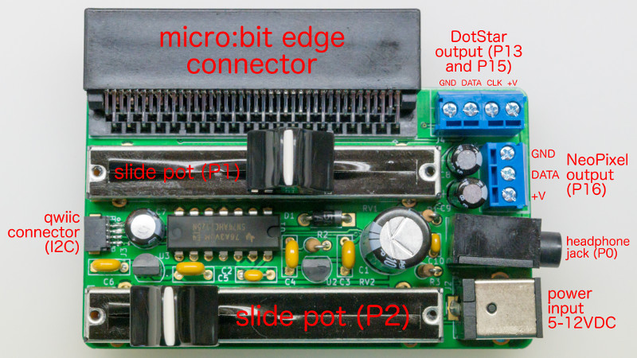
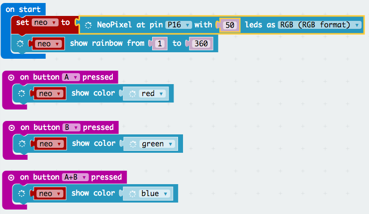
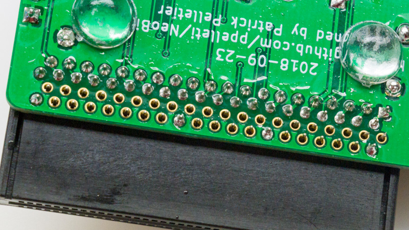
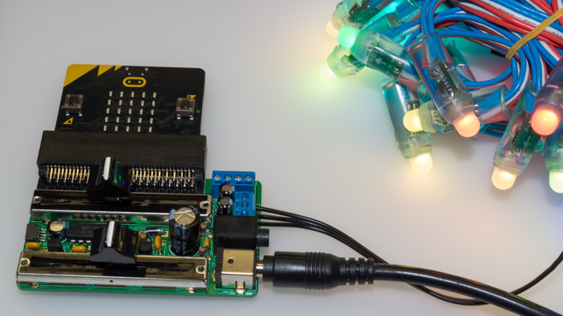
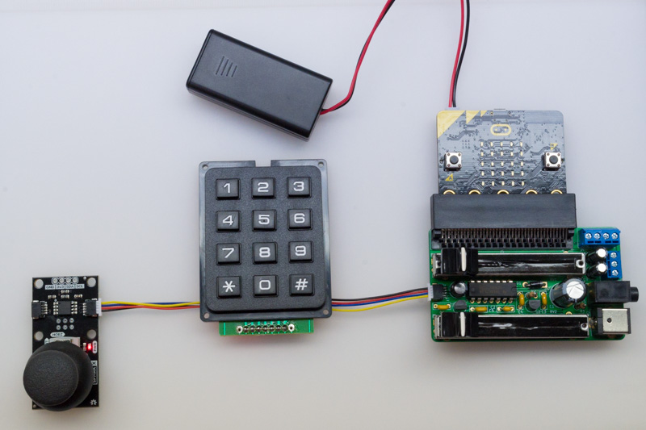

# neo:bit

The neo:bit is a board which attaches to the [edge connector][11] of
the [BBC micro:bit][16] and provides:

* Two slide potentiometers, connected to micro:bit pins P1 and P2,
  which can be read as analog inputs.

* A terminal block for connecting "[NeoPixels][92]" (WS-2812 LEDs),
  with a level shifter to convert from 3.3V logic (on pin P16) to 5V
  logic.

* A terminal block for connecting "[DotStars][93]" (APA-102 LEDs),
  with a level shifter to convert from 3.3V logic (on pins P13 and
  P15) to 5V logic.

* A [Qwiic][89] connector for attaching I2C peripherals.

* A 3.5mm audio jack for headphones.  (Connected to pin P0).

* A barrel connector for an external 5-12V power supply, which is
  mandatory for powering the NeoPixels, and can also optionally
  backpower the micro:bit safely.

This repository contains [KiCad][83] and [gerber][84] files for the
neo:bit board.

* [View schematic](doc/schematic.pdf)
* [View PCB][30]

## Usage

### Power

Note that the voltage which comes in on the barrel jack is used
directly to power the NeoPixels and DotStars, so you need to choose a
voltage which is appropriate for the NeoPixels and/or DotStars you are
using.  Most NeoPixels are 5V, although there are a few
[12V ones][90].  I don't know of any DotStars which are not 5V.  You
can't have a different voltage for the NeoPixels and the DotStars.

The neo:bit contains a low-dropout 3.3V voltage regulator, which is
used for back-powering the micro:bit, and for supplying the 3.3V power
on the Qwiic connector.  You probably shouldn't draw more than 90 mA
on the Qwiic connector's power pin.

The neo:bit also contains a low-dropout 5V voltage regulator, but that
is just to supply the 5V signal on the NeoPixel and DotStar data
lines.

### Potentiometers

To read the slide potentiometers, just configure P1 and P2 as analog
inputs, and read them.  The idea is that you could use these inputs to
control your NeoPixel animation, such as the speed, color, or
brightness.

### NeoPixels

J4 has the NeoPixel output, along with +V and GND.  You may want to
connect a [JST-SM pigtail][80] to the J4 screw terminals.  This will
let you connect strings of 5V NeoPixels, such as ones from
[Alitove][19] or [Wesiri][81], or my
[chainable NeoPixel butterflies][20].  (The Wesiri lights come with
the necessary pigtail, so you don't need to buy one separately.)

You must have an external power supply (such as [this one][23] or
[this one][24] for 5V, or [this one][91] for 12V) connected to the
neo:bit's barrel jack in order to power the NeoPixels.  If the
external power supply is connected, the neo:bit will also supply 3.3V
back to the micro:bit, so it is not necessary to power the micro:bit
from another source.  (However, this is done with a protection diode,
so it is OK to have the micro:bit connected to another source at the
same time the external supply is connected.)  If you only want to use
the potentiometers and/or Qwiic but not the NeoPixel output or DotStar
output, then you do not need to have an external supply connected, as
long as the micro:bit is powered by another source.

Following the [NeoPixel best practices][25], the neo:bit includes a
470 ohm resistor on the NeoPixel data line, and there is a 1000µF
capacitor on the +V power line.

Once you have your NeoPixels hooked up, you should be able to access
them by instantiating a NeoPixel strip on pin P16 in either
[MakeCode][27] or [Python][28].  The Alitove and Wesiri strings, as
well as my NeoPixel butterflies, use RGB order instead of the default
GRB order.

## Ordering the Board

You can order this board [directly from OSH Park][29] without needing
to upload anything.

Or, if you prefer to go with another fab like [Elecrow][86] or
[JLCPCB][87], all you need to do is zip up the files in the `gerber`
directory, and upload that zip file to the fab.

If you want to modify the design, the source is provided in
[KiCad][83] format.

## Bill of Materials

| Ref      | Description                      | MPN                 | Digi-Key PN                  |
| -------- | -------------------------------- | ------------------- | ---------------------------- |
| C1       | CAP ALUM 1000UF 20% 25V RADIAL   | 25PX1000MEFCT810X16 | [1189-1583-1-ND][C1]         |
| C2       | CAP CER 0.1UF 50V X7R RADIAL     | K104K10X7RF5UH5     | [BC2665CT-ND][C2]            |
| C3-C6    | CAP CER 1UF 50V Y5V RADIAL       | K105Z20Y5VF5TH5     | [BC1168CT-ND][C3]            |
| C7       | CAP ALUM 47UF 20% 16V RADIAL     | ECE-A1CKS470        | [P969-ND][C7]                |
| C8, C9   | CAP ALUM 220UF 20% 10V RADIAL    | UVK1A221MDD1TD      | [493-7455-1-ND][C8]          |
| C10      | CAP CER 10000PF 50V X7R RADIAL   | K103K15X7RF5TL2     | [BC1078CT-ND][C10]           |
| D1       | DIODE SCHOTTKY 20V 1A DO41       | 1N5817              | [1N5817FSCT-ND][D1]          |
| J1       | CONN JACK STEREO 3.5MM R/A       | SJ1-3533NG          | [CP1-3533NG-ND][J1]          |
| J2       | CONN PWR JACK 2X5.5MM SOLDER     | PJ-063AH            | [CP-063AH-ND][J2]            |
| J3       | Qwiic JST Connector - SMD 4-pin  | [PRT-14417][J3]     | (SparkFun)                   |
| J4       | TERM BLOCK 4POS SIDE ENT 3.5MM   | 1776275-4           | [A98038-ND][J4]              |
| J5       | micro:bit through-hole right-angle edge connector | [3342][J5] | (Adafruit)           |
| J6       | TERM BLOCK 3POS SIDE ENT 3.5MM   | 1776275-3           | [A98037-ND][J6]              |
| R1       | RES 100 OHM 1/4W 5% AXIAL        | CF14JT100R          | [CF14JT100RCT-ND][R1]        |
| R2       | RES 470 OHM 1/4W 5% AXIAL        | CF14JT470R          | [CF14JT470RCT-ND][R2]        |
| R3       | RES 22 OHM 1/4W 5% AXIAL         | CF14JT22R0          | [CF14JT22R0CT-ND][R3]        |
| RV1, RV2 | SLIDE POT 10K OHM 0.25W TOP 45MM | PTA4553-2015CPB103  | [PTA4553-2015CPB103-ND][RV1] |
| U1       | IC BUF NON-INVERT 5.5V 14DIP     | SN74AHCT125N        | [296-4655-5-ND][U1]          |
| U2       | IC REG LINEAR 3.3V 250MA TO92-3  | MCP1702-3302E/TO    | [MCP1702-3302E/TO-ND][U2]    |
| U3       | IC REG LINEAR 5V 250MA TO92-3    | MCP1702-5002E/TO    | [MCP1702-5002E/TO-ND][U3]    |
| (qty 2)  | KNOB SMOOTH 0.157 X 0.039" NYLON | 1300-E              | [1722-1329-ND][61]           |

Plus you'll need a micro:bit, a power supply (such as [this one][82]),
and some NeoPixels.

The right-angle micro:bit edge connector (J5) is 4UCON 10156, which is
available from [Adafruit][J5] in the US and from [Cool Components][26]
in the UK.

## Assembly

Most of the assembly should be straightforward, but there are a few
connectors worthy of more discussion.

### Qwiic connector

The four electrical pins are not enough to hold this connector in
place.  There are two mounting pins which are also meant to be
soldered, but I found hand-soldering them was nearly impossible.  So,
I used a drop of epoxy to hold the Qwiic connector in place.

### Terminal blocks

I've found that stranded wires don't stay in the terminal blocks very
well, so I recommend using solid wire.  Or, you may wish to omit the
terminal blocks entirely and solder wires directly to the board.

### micro:bit connector

The micro:bit connector has 80 pins, but only 40 of them need to be
soldered.  The pins that need to be soldered are the two rows farthest
from the edge.  (These pins are slightly taller than the others.)  I
usually solder just a few of the pins on the row closest to the edge,
too, just for mechanical stability.

## License

The files in this repo are licensed under [CC-BY-SA 4.0][10].

Some symbols and footprints in this repo are under different licenses:

* [microbit_edge_connector][1] symbol by [anthonykirby][3] and [4UCON_10156_90deg][2] footprint (which I have substantially modified) by [SukkoPera][4] ([MIT License][5]).
* 74AHCT125 symbol is a substantially modified version of the symbol from [a library][6] by [propane-and-electrons][7].
* Barrel_Jack_MountingPin symbol is from [the official KiCad 5 library][8], and R_POT_Mountingpin symbol is derived from a symbol in the official library ([CC-BY-SA 4.0 with exception][9]).
* The TerminalBlock_4Ucon_* footprints are also from the official KiCad 5 library.

[1]: https://github.com/anthonykirby/kicad_microbit_connector/blob/master/lib_microbit_connector/lib_microbit_connector.lib
[2]: https://github.com/SukkoPera/OpenAmiga600RamExpansion/blob/master/OpenAmiga600RamExpansion.pretty/4UCON_10156_90deg.kicad_mod
[3]: https://github.com/anthonykirby
[4]: https://github.com/SukkoPera
[5]: https://github.com/anthonykirby/kicad_microbit_connector/blob/master/LICENSE
[6]: https://github.com/propane-and-electrons/kicad-libs/blob/master/shardy.lib
[7]: https://github.com/propane-and-electrons
[8]: https://github.com/KiCad/kicad-symbols/blob/master/Connector.lib
[9]: https://forum.kicad.info/t/kicad-library-licensing/7856
[10]: https://creativecommons.org/licenses/by-sa/4.0/legalcode
[11]: https://tech.microbit.org/hardware/edgeconnector_ds/
[16]: https://microbit.org/
[17]: https://www.sparkfun.com/products/14165
[18]: https://cdn.sparkfun.com/datasheets/Prototyping/ACCA-1495.pdf
[19]: https://smile.amazon.com/gp/product/B01AG923GI/
[20]: https://github.com/ppelleti/ButterflyChain
[23]: https://www.adafruit.com/product/1466
[24]: https://www.adafruit.com/product/658
[25]: https://learn.adafruit.com/adafruit-neopixel-uberguide/best-practices
[26]: https://coolcomponents.co.uk/products/edge-connector-for-bbc-micro-bit
[27]: https://makecode.microbit.org/pkg/microsoft/pxt-neopixel
[28]: https://microbit-micropython.readthedocs.io/en/latest/neopixel.html
[29]: https://oshpark.com/shared_projects/cOlGXHEk
[30]: https://eyrie.io/board/9e1a5f1d622a41188564be353a699805
[80]: https://www.adafruit.com/product/1663
[81]: https://smile.amazon.com/gp/product/B075T84ZR3/
[82]: https://www.adafruit.com/product/1466
[83]: http://kicad-pcb.org/
[84]: https://en.wikipedia.org/wiki/Gerber_format
[86]: https://www.elecrow.com/pcb-manufacturing.html
[87]: https://jlcpcb.com/quote
[89]: https://www.sparkfun.com/qwiic
[90]: https://www.adafruit.com/product/3869
[91]: https://www.adafruit.com/product/352
[92]: https://www.adafruit.com/category/168
[93]: https://www.adafruit.com/category/885

[C1]: https://www.digikey.com/products/en?keywords=1189-1583-1-ND
[C2]: https://www.digikey.com/products/en?keywords=BC2665CT-ND
[C3]: https://www.digikey.com/products/en?keywords=BC1168CT-ND
[C7]: https://www.digikey.com/products/en?keywords=P969-ND
[C8]: https://www.digikey.com/products/en?keywords=493-7455-1-ND
[C10]: https://www.digikey.com/products/en?keywords=BC1078CT-ND
[D1]: https://www.digikey.com/products/en?keywords=1N5817FSCT-ND
[J1]: https://www.digikey.com/products/en?keywords=CP1-3533NG-ND
[J2]: https://www.digikey.com/products/en?keywords=CP-063AH-ND
[J3]: https://www.sparkfun.com/products/14417
[J4]: https://www.digikey.com/products/en?keywords=A98038-ND
[J5]: https://www.adafruit.com/product/3342
[J6]: https://www.digikey.com/products/en?keywords=A98037-ND
[R1]: https://www.digikey.com/products/en?keywords=CF14JT100RCT-ND
[R2]: https://www.digikey.com/products/en?keywords=CF14JT470RCT-ND
[R3]: https://www.digikey.com/products/en?keywords=CF14JT22R0CT-ND
[RV1]: https://www.digikey.com/products/en?keywords=PTA4553-2015CPB103-ND
[U1]: https://www.digikey.com/products/en?keywords=296-4655-5-ND
[U2]: https://www.digikey.com/products/en?keywords=MCP1702-3302E%2FTO-ND
[U3]: https://www.digikey.com/products/en?keywords=MCP1702-5002E%2FTO-ND
